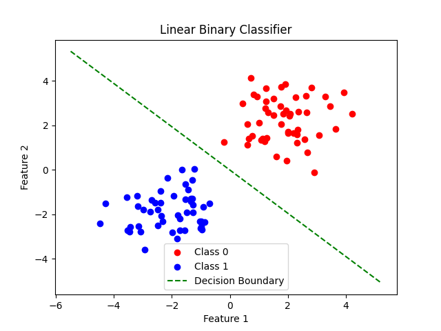
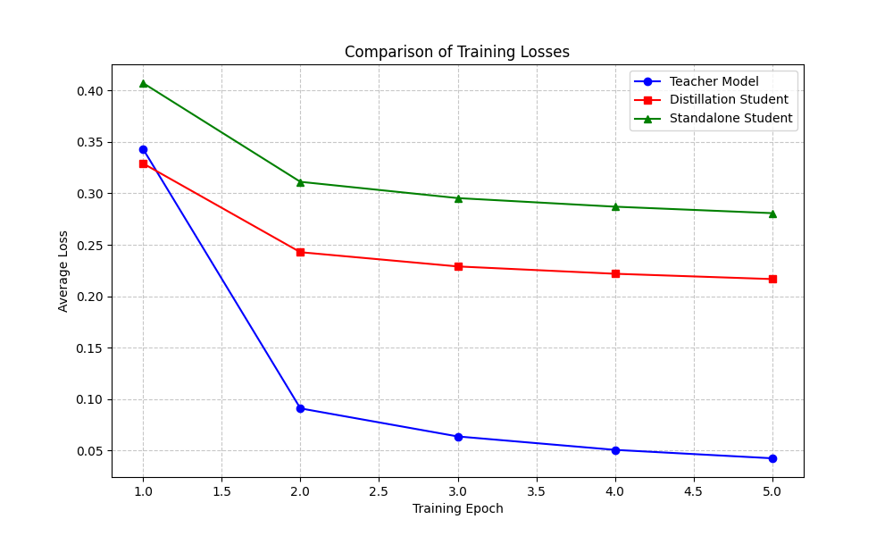

# All-in-AI: AI Model Practice Project

Chinese version available: [README_zh.md](README_zh.md)

This project serves as a practice repository for understanding various AI models through simple code implementations. Each model is accompanied by minimal, explanatory code to demonstrate core concepts.

## Project Structure
- Each model has its own directory with implementation code
- Code includes comments explaining key concepts and algorithms
- Simple examples demonstrating model usage

## 🚀 Featured Models
Explore our collection of hands-on AI implementations, each designed to teach core concepts through practical code:

### 1. linear_nn_fit-01: Configurable Linear Neural Network
- **Key Concepts**: Linear regression, sigmoid activation, dual-layer configurationsor different activation configurations
- **What You'll Learn**: How activation functions and layer depth impact model performance

### 2. linear-classifier-02: Basic Linear Classification
- **Key Concepts**: Binary classification, decision boundary visualization, SGD optimization
- **Visualizations**: 
- **Core Components**: `nn.Linear`, `nn.Sigmoid`, `nn.BCELoss`

### 3. mnist_classifier-03: MNIST Digit Classification
- **Key Concepts**: Multi-class classification, fully connected networks, ReLU activation
- **Architecture**: 784→128→10 layer configuration with ReLU non-linearity
- **Performance**: ~97% accuracy on test set

### 4. mnist_cnn-04: Convolutional Neural Network
- **Key Concepts**: 2D convolutions, max pooling, feature extraction
- **Architecture**: Two convolutional layers (20→50 filters) followed by fully connected layers
- **What You'll Learn**: How CNNs capture spatial features in images

### 5. mnist_distillation-05: Knowledge Distillation
- **Key Concepts**: Teacher-student models, knowledge transfer, KLDivLoss
- **Visualizations**: 
- **Models**: Teacher (complex CNN) and Student (simplified network) implementation

### 6. mnist_gan-06: Generative Adversarial Network
- **Key Concepts**: GAN architecture, adversarial training, image generation
- **Visualizations**: [generated images](mnist_gan-06/generated_images/) (sample outputs across 50 epochs)
- **Components**: Deep convolutional generator and discriminator with BatchNorm

### 7. transformer_gpt2_07: Transformer Text Generation
- **Key Concepts**: Self-attention, causal masking, text generation
- **Architecture**: Mini-GPT implementation with multi-head attention
- **Applications**: Character-level text generation

### 8. transformer_finetune-08: Transformer Fine-tuning
- **Key Concepts**: Transfer learning, emotion classification, model fine-tuning
- **Visualizations**: [accuracy plot](transformer_finetune-08/accuracy-plot.pdf)
  - Loss curves: [loss plot](transformer_finetune-08/loss-plot.pdf)
- **Performance**: 89% accuracy on emotion classification task

### 9. transformer_flash_attention-09: Efficient Transformer Implementation
- **Key Concepts**: Flash Attention, optimized transformer architecture, memory efficiency
- **What You'll Learn**: How Flash Attention reduces memory usage and speeds up training
- **Optimizations**: Implementation of the Flash Attention algorithm for faster computation

### 10. rl-basic-10: Reinforcement Learning Fundamentals
- **Key Concepts**: Markov decision processes, policy gradients, value iteration
- **Algorithms Implemented**: DQN, PPO, and Actor-Critic methods
- **Applications**: Training agents to play simple games and solve control tasks

### 11. vae-image-11: Variational Autoencoder for Images
- **Key Concepts**: Probabilistic autoencoders, latent space, image generation
- **Visualizations**: [results](vae-image-11/results/)
- **What You'll Learn**: How VAEs can compress and generate images with probabilistic modeling

### 12. residual-12: Residual Networks
- **Key Concepts**: Residual connections, deep network training, gradient flow
- **Visualizations**: [loss comparison](residual-12/loss_comparison.png), [weight comparison](residual-12/weight_comparison_table.png)
- **What You'll Learn**: How residual connections enable training of very deep neural networks

### 13. grpo_rl_gpt-13: RL for Language Models
- **Key Concepts**: Reinforcement Learning from Human Feedback (RLHF), policy optimization
- **Visualizations**: [training rewards](grpo_rl_gpt-13/training_rewards.png)
- **Applications**: Fine-tuning language models with reinforcement learning

### 14. gpt2_finetuning_demo-14: GPT-2 Fine-tuning
- **Key Concepts**: Transfer learning for language models, text generation
- **Dataset**: Chinese poetry corpus
- **What You'll Learn**: How to fine-tune pre-trained language models for specific tasks

### 15. transformer_quantization-12: Model Quantization
- **Key Concepts**: Post-training quantization, model compression, inference optimization
- **What You'll Learn**: How to reduce model size and speed up inference with minimal accuracy loss

### 16. diffusion-basic-16: Diffusion Models
- **Key Concepts**: Denoising diffusion, probabilistic modeling, image generation
- **Training Process**: Gradual noise addition and removal process
- **Applications**: Generating high-quality images from noise

### 17. random_forest-17: Ensemble Learning
- **Key Concepts**: Decision trees, ensemble methods, feature importance
- **Visualizations**: [confusion matrix](random_forest-17/confusion_matrix.png), [feature importance](random_forest-17/feature_importance.png)
- **Applications**: Classification and regression tasks with interpretability

## Getting StNavl directory (e.g., `cd linear_nn_fit-01`)
3. Install dependencies: `pip install -r requirements.txt`
4. Run the example: `python main.py`

## Requirements
- Python 3.12.0
- PyTorch 2.0.0+ and torchvision 0.20.0+ (see requirements.txt for details)
- NumPy, Matplotlib

## Contributing
We're continuously expanding this collection with new mini-implementations of cutting-edge AI models. Star this repository to stay updated on new additions and implementations!
Feel free to add implementations of other AI models with clear explanations.