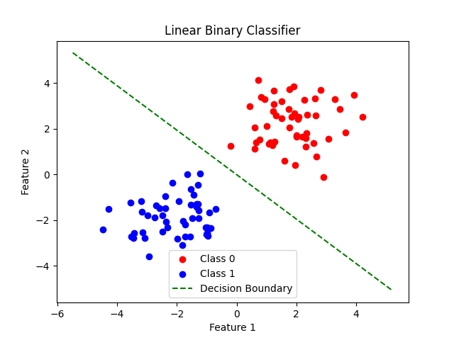
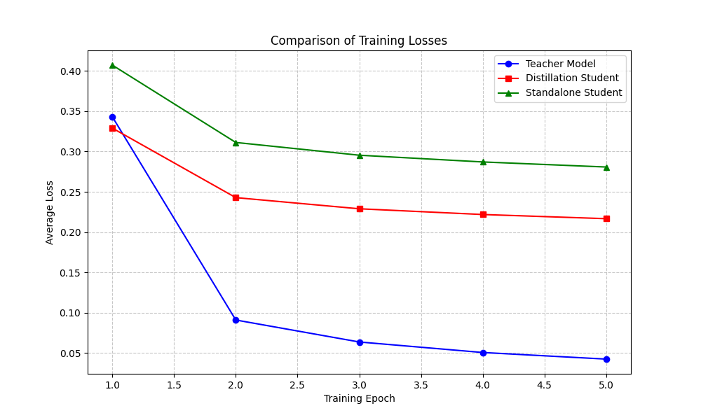

# All-in-AI: AI模型实践项目

English version available: [README.md](README.md)

本项目是一个AI模型实践仓库，通过简洁的代码实现帮助理解各种AI模型。每个模型都配有详尽注释的代码，以演示核心概念。

## 项目结构
- 每个模型拥有独立目录及实现代码
- 代码包含解释关键概念和算法的注释
- 简单示例展示模型使用方法

## 🚀 精选模型
探索我们的实践AI实现集合，每个模型都旨在通过实际代码教授核心概念：

### 1. linear_nn_fit-01: 可配置线性神经网络
- **核心概念**：线性回归、sigmoid激活函数、双层网络配置
- **可视化内容**：不同激活配置的决策边界图
- **学习要点**：激活函数和网络深度如何影响模型性能

### 2. linear-classifier-02: 基础线性分类器
- **核心概念**：二分类、决策边界可视化、SGD优化
- **可视化内容**：
- **核心组件**：`nn.Linear`、`nn.Sigmoid`、`nn.BCELoss`

### 3. mnist_classifier-03: MNIST数字分类
- **核心概念**：多分类、全连接网络、ReLU激活函数
- **网络架构**：784→128→10层结构，带ReLU非线性激活
- **性能表现**：测试集准确率约97%

### 4. mnist_cnn-04: 卷积神经网络
- **核心概念**：二维卷积、最大池化、特征提取
- **网络架构**：两个卷积层(20→50滤波器)后接全连接层
- **学习要点**：CNN如何捕捉图像中的空间特征

### 5. mnist_distillation-05: 知识蒸馏
- **核心概念**：师生模型、知识迁移、KLDivLoss
- **可视化内容**：
- **模型组成**：教师模型(复杂CNN)和学生模型(简化网络)实现

### 6. mnist_gan-06: 生成对抗网络
- **核心概念**：GAN架构、对抗训练、图像生成
- **可视化内容**：[生成图像](mnist_gan-06/generated_images/)